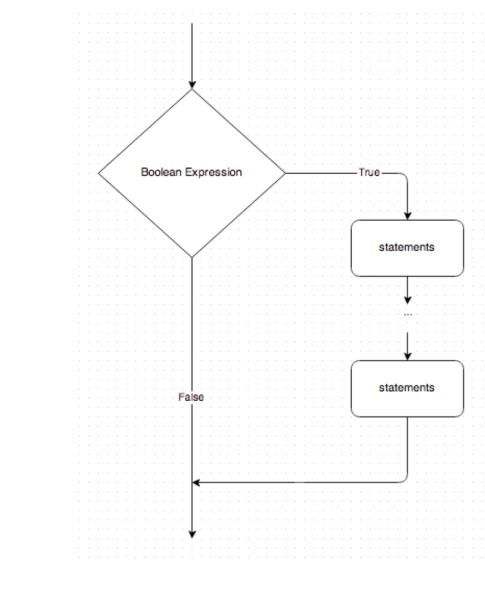
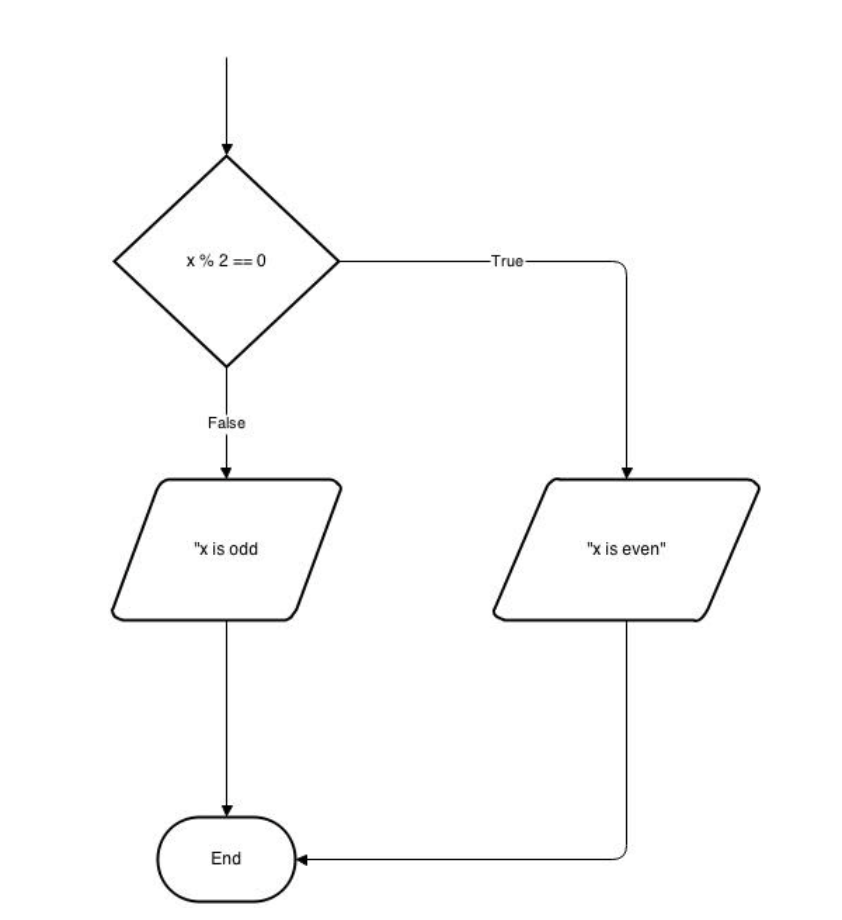
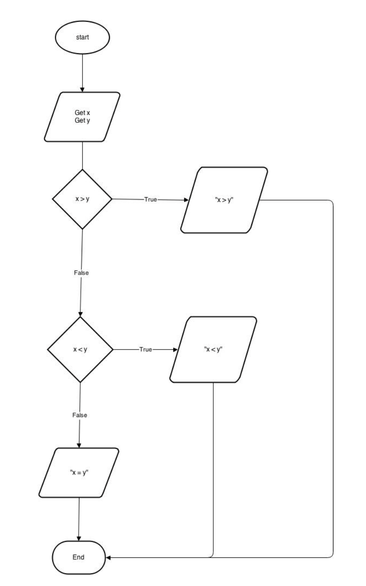

# 2.3 If Statements


## Conditional Execution 

In order to write useful programs, we almost always need the ability to check conditions and change the behavior of the program accordingly. Conditional statements give us this ability. The simplest form is the if statement:


```
if (x > 0){
  System.out.println("x is positive");
}


```


* The boolean expression after if is called the condition. If it is true, then the indented statement gets executed. If not, nothing happens.
* if statements are what is known as a **compound statement:**  a **header** followed by an **indented body**. 
* There is no limit on the number of statements that can appear in the body, but there has to be at least one. 





## Alternative Execution


```


```


A second form of the if statement is alternative execution, in which there are two possibilities and the condition determines which one gets executed. The syntax looks like this:


```
if (x % 2 == 0){
  System.out.println("x is even");
}
else{
  System.out.println("x is odd");
}
```


In this program:


* If the remainder when x is divided by 2 is 0, then we know that x is even, and the program displays a message to that effect. 
* If the condition is false, the second set of statements is executed. Since the condition must be true or false, exactly one of the alternatives will be executed. The alternatives are called branches, because they are branches in the flow of execution.





## Chained Conditionals 

Sometimes there are more than two possibilities and we need more than two branches.

One way to express a computation like that is a chained conditional:


```
if (x > y){
    System.out.println("x is greater than y");
}else if(x < y){
    System.out.println("x is less than y");
}else{
    System.out.println("x and y are equal");
}
```




* Exactly one branch will be executed. 
* There is no limit on the number of `else if` statements. If there is an else clause, it has to be at the end, but there doesn’t have to be one.


```
if (choice == 'a'){
    draw_a();
}else if(choice == 'b'){
    draw_b();
}else if (choice == 'c'){
    draw_c();
}


```


Each condition is checked in order. If the first is false, the next is checked, and so on. If

one of them is true, the corresponding branch executes, and the statement ends. Even

if more than one condition is true, only the first true branch executes.

## Nested Conditionals

One conditional can also be nested within another. We could have written the trichotomy example like this:


```
if (x == y){
    System.out.println('x and y are equal');
}else{
    if(x < y){
        System.out.println('x is less than y');
    }else{
        System.out.println('x is greater than y');
}
```


* The outer conditional contains two branches. The first branch contains a simple statement. 
* The second branch contains another if statement, which has two branches of its own.
    * Those two branches are both simple statements, although they could have been conditional statements as well.

Although the indentation of the statements makes the structure apparent,** nested conditionals **become difficult to read very quickly. In general, it is a good idea to avoid them when you can.
